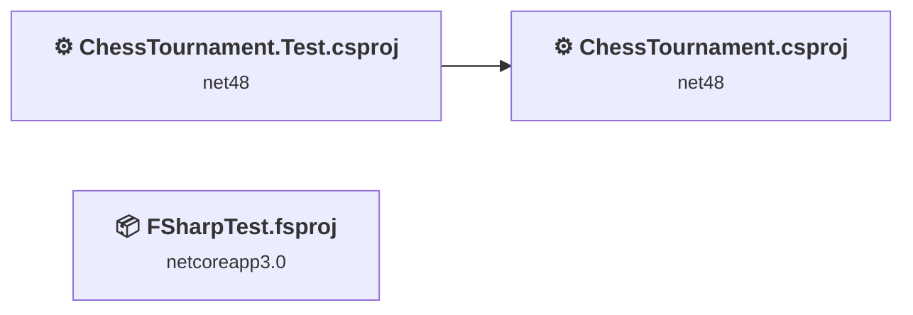
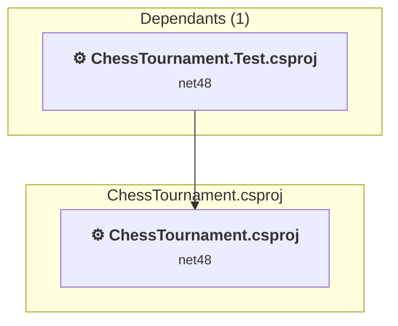
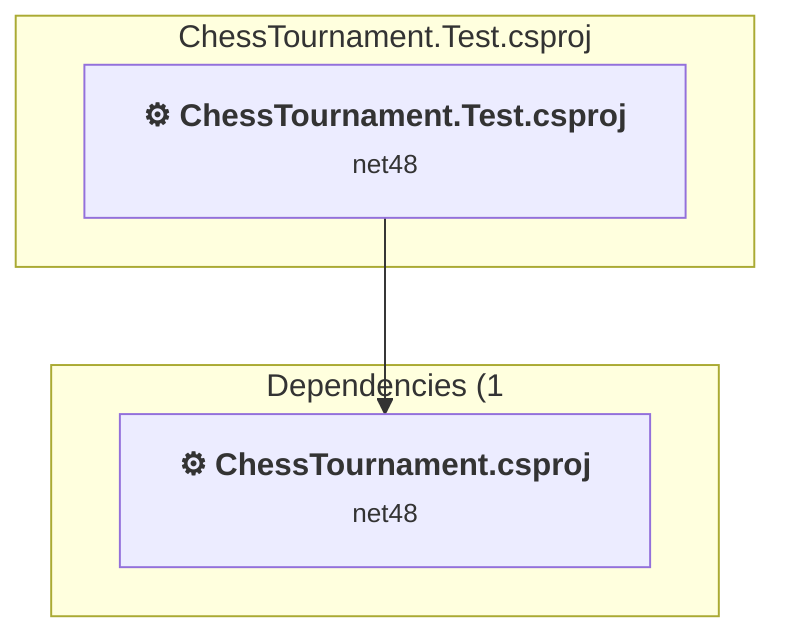
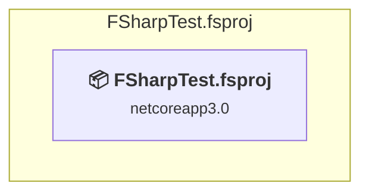

# Projects and dependencies analysis

This document provides a comprehensive overview of the projects and their dependencies in the context of upgrading to .NETCoreApp,Version=v10.0.

## Table of Contents

- [Executive Summary](#executive-Summary)
  - [Highlevel Metrics](#highlevel-metrics)
  - [Projects Compatibility](#projects-compatibility)
  - [Package Compatibility](#package-compatibility)
  - [API Compatibility](#api-compatibility)
  - [Binding Redirect Configuration](#binding-redirect-configuration)
- [Aggregate NuGet packages details](#aggregate-nuget-packages-details)
- [Top API Migration Challenges](#top-api-migration-challenges)
  - [Technologies and Features](#technologies-and-features)
  - [Most Frequent API Issues](#most-frequent-api-issues)
- [Projects Relationship Graph](#projects-relationship-graph)
- [Project Details](#project-details)

  - [ChessTournament\ChessTournament.csproj](#chesstournamentchesstournamentcsproj)
  - [ChesTournament.Test\ChessTournament.Test.csproj](#chestournamenttestchesstournamenttestcsproj)
  - [FSharpTest\FSharpTest.fsproj](#fsharptestfsharptestfsproj)

## Executive Summary

### Highlevel Metrics

| Metric | Count | Status |
| :--- | :---: | :--- |
| Total Projects | 3 | All require upgrade |
| Total NuGet Packages | 12 | All compatible |
| Total Code Files | 19 |  |
| Total Code Files with Incidents | 3 |  |
| Total Lines of Code | 2268 |  |
| Total Number of Issues | 7 |  |
| Estimated LOC to modify | 0+ | at least 0.0% of codebase |

### Projects Compatibility

| Project | Target Framework | Difficulty | Package Issues | API Issues | Binding Issues | Est. LOC Impact | Description |
| :--- | :---: | :---: | :---: | :---: | :---: | :---: | :--- |
| [ChessTournament\ChessTournament.csproj](#chesstournamentchesstournamentcsproj) | net48 | 🟢 Low | 1 | 0 | 0 |  | ClassicDotNetApp, Sdk Style = False |
| [ChesTournament.Test\ChessTournament.Test.csproj](#chestournamenttestchesstournamenttestcsproj) | net48 | 🟢 Low | 0 | 0 | 1 |  | ClassicClassLibrary, Sdk Style = False |
| [FSharpTest\FSharpTest.fsproj](#fsharptestfsharptestfsproj) | netcoreapp3.0 | 🟢 Low | 0 | 0 | 0 |  | DotNetCoreApp, Sdk Style = True |

### Package Compatibility

| Status | Count | Percentage |
| :--- | :---: | :---: |
| ✅ Compatible | 12 | 100.0% |
| ⚠️ Incompatible | 0 | 0.0% |
| 🔄 Upgrade Recommended | 0 | 0.0% |
| ***Total NuGet Packages*** | ***12*** | ***100%*** |

### API Compatibility

| Category | Count | Impact |
| :--- | :---: | :--- |
| 🔴 Binary Incompatible | 0 | High - Require code changes |
| 🟡 Source Incompatible | 0 | Medium - Needs re-compilation and potential conflicting API error fixing |
| 🔵 Behavioral change | 0 | Low - Behavioral changes that may require testing at runtime |
| ✅ Compatible | 1166 |  |
| ***Total APIs Analyzed*** | ***1166*** |  |

### Binding Redirect Configuration

| Severity | Count | Description |
| :--- | :---: | :--- |
| 🟡Potential | 1 | May cause issues in certain scenarios |
| ***Total Binding Issues*** | ***1*** | ***Across 1 project(s)*** |

## Aggregate NuGet packages details

| Package | Current Version | Suggested Version | Projects | Description |
| :--- | :---: | :---: | :--- | :--- |
| FSharp.Core | 10.1.302 |  | [FSharpTest.fsproj](#fsharptestfsharptestfsproj) | ✅Compatible |
| NUnit | 3.14.0 |  | [ChessTournament.Test.csproj](#chestournamenttestchesstournamenttestcsproj) | ✅Compatible |
| NUnit.Console | 3.16.3 |  | [ChessTournament.Test.csproj](#chestournamenttestchesstournamenttestcsproj) | ✅Compatible |
| NUnit.ConsoleRunner | 3.16.3 |  | [ChessTournament.Test.csproj](#chestournamenttestchesstournamenttestcsproj) | ✅Compatible |
| NUnit.Extension.NUnitProjectLoader | 3.7.1 |  | [ChessTournament.Test.csproj](#chestournamenttestchesstournamenttestcsproj) | ✅Compatible |
| NUnit.Extension.NUnitV2Driver | 3.9.0 |  | [ChessTournament.Test.csproj](#chestournamenttestchesstournamenttestcsproj) | ✅Compatible |
| NUnit.Extension.NUnitV2ResultWriter | 3.7.0 |  | [ChessTournament.Test.csproj](#chestournamenttestchesstournamenttestcsproj) | ✅Compatible |
| NUnit.Extension.TeamCityEventListener | 1.0.9 |  | [ChessTournament.Test.csproj](#chestournamenttestchesstournamenttestcsproj) | ✅Compatible |
| NUnit.Extension.VSProjectLoader | 3.9.0 |  | [ChessTournament.Test.csproj](#chestournamenttestchesstournamenttestcsproj) | ✅Compatible |
| NUnit.Runners | 3.12.0 |  | [ChessTournament.Test.csproj](#chestournamenttestchesstournamenttestcsproj) | ✅Compatible |
| NUnit3TestAdapter | 4.5.0 |  | [ChessTournament.Test.csproj](#chestournamenttestchesstournamenttestcsproj) | ✅Compatible |
| System.ValueTuple | 4.5.0 |  | [ChessTournament.csproj](#chesstournamentchesstournamentcsproj) | NuGet package functionality is included with framework reference |

## Top API Migration Challenges

### Technologies and Features

| Technology | Issues | Percentage | Migration Path |
| :--- | :---: | :---: | :--- |

### Most Frequent API Issues

| API | Count | Percentage | Category |
| :--- | :---: | :---: | :--- |

## Projects Relationship Graph

Legend:
📦 SDK-style project
⚙️ Classic project

## Project Details

### ChessTournament\ChessTournament.csproj

#### Project Info

- **Current Target Framework:** net48
- **Proposed Target Framework:** net10.0
- **SDK-style**: False
- **Project Kind:** ClassicDotNetApp
- **Dependencies**: 0
- **Dependants**: 1
- **Number of Files**: 16
- **Number of Files with Incidents**: 1
- **Lines of Code**: 2162
- **Estimated LOC to modify**: 0+ (at least 0.0% of the project)

#### Dependency Graph

Legend:
📦 SDK-style project
⚙️ Classic project

### API Compatibility

| Category | Count | Impact |
| :--- | :---: | :--- |
| 🔴 Binary Incompatible | 0 | High - Require code changes |
| 🟡 Source Incompatible | 0 | Medium - Needs re-compilation and potential conflicting API error fixing |
| 🔵 Behavioral change | 0 | Low - Behavioral changes that may require testing at runtime |
| ✅ Compatible | 1084 |  |
| ***Total APIs Analyzed*** | ***1084*** |  |

### ChesTournament.Test\ChessTournament.Test.csproj

#### Project Info

- **Current Target Framework:** net48
- **Proposed Target Framework:** net10.0
- **SDK-style**: False
- **Project Kind:** ClassicClassLibrary
- **Dependencies**: 1
- **Dependants**: 0
- **Number of Files**: 2
- **Number of Files with Incidents**: 1
- **Lines of Code**: 98
- **Estimated LOC to modify**: 0+ (at least 0.0% of the project)

#### Dependency Graph

Legend:
📦 SDK-style project
⚙️ Classic project

### API Compatibility

| Category | Count | Impact |
| :--- | :---: | :--- |
| 🔴 Binary Incompatible | 0 | High - Require code changes |
| 🟡 Source Incompatible | 0 | Medium - Needs re-compilation and potential conflicting API error fixing |
| 🔵 Behavioral change | 0 | Low - Behavioral changes that may require testing at runtime |
| ✅ Compatible | 82 |  |
| ***Total APIs Analyzed*** | ***82*** |  |

#### Binding Redirect Configuration

| Rule | Severity | Details | Recommendation |
| :--- | :---: | :--- | :--- |
| Library-hosted entry point missing GenerateBindingRedirectsOutputType | 🟡Potential | OutputType=Library with test framework references, GenerateBindingRedirectsOutputType not set | Add <GenerateBindingRedirectsOutputType>true</GenerateBindingRedirectsOutputType> so MSBuild generates redirects for library-hosted entry points. |

### FSharpTest\FSharpTest.fsproj

#### Project Info

- **Current Target Framework:** netcoreapp3.0
- **Proposed Target Framework:** net10.0
- **SDK-style**: True
- **Project Kind:** DotNetCoreApp
- **Dependencies**: 0
- **Dependants**: 0
- **Number of Files**: 1
- **Number of Files with Incidents**: 1
- **Lines of Code**: 8
- **Estimated LOC to modify**: 0+ (at least 0.0% of the project)

#### Dependency Graph

Legend:
📦 SDK-style project
⚙️ Classic project

### API Compatibility

| Category | Count | Impact |
| :--- | :---: | :--- |
| 🔴 Binary Incompatible | 0 | High - Require code changes |
| 🟡 Source Incompatible | 0 | Medium - Needs re-compilation and potential conflicting API error fixing |
| 🔵 Behavioral change | 0 | Low - Behavioral changes that may require testing at runtime |
| ✅ Compatible | 0 |  |
| ***Total APIs Analyzed*** | ***0*** |  |

